# Giant Particle - Inspector Graph <!-- omit in toc -->
The Inspector Graph is a tool to better visualize, understand and manipulate objects in a reference hierarchy.

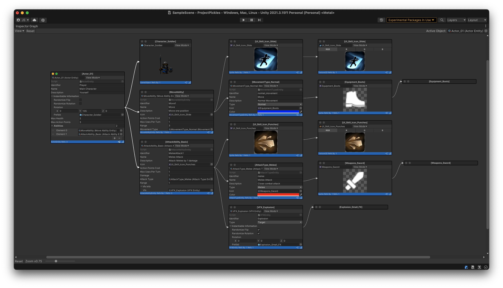

## Index <!-- omit in toc -->
- [Main Features](#main-features)
- [Main Window](#main-window)
  - [Controls](#controls)
    - [View Menu](#view-menu)
    - [Reset Button](#reset-button)
    - [Inspected Object Reference](#inspected-object-reference)
    - [Zoom Controls](#zoom-controls)
- [Inspector Window](#inspector-window)
  - [Controls](#controls-1)
    - [Window controls](#window-controls)
    - [Toolbar](#toolbar)
    - [Footer](#footer)
      - [Stats](#stats)
      - [Controls](#controls-2)
  - [Views](#views)
    - [Inspector Element](#inspector-element)
    - [IMGUI](#imgui)
    - [Preview](#preview)
    - [Static Preview](#static-preview)
  - [References](#references)
    - [Highlighting](#highlighting)

## Main Features
* Object display as individual floating window
* Multiple View modes available per object
* Visual representation of references from and to objects
* In-Place field editing
* Zoom control for better visualization
* and more...

## Main Window

### Controls
The main window has multiple controls for you to use

#### View Menu
The view menu lets you control some visual elements of the graph hierarchy.

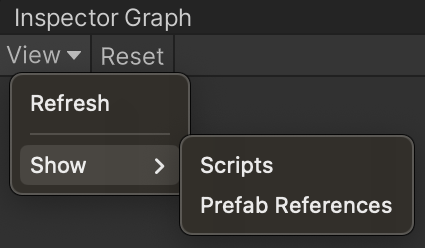

* **Refresh**: The refresh button lets you update the current graph with any changes that were not picked up while editing. It also rearranges the untouched windows in the graph to accommodate new windows or window positions.
* **Show > Scripts**: This option enables the visualization of MonoScripts involved in the hierarchy. By default this is disabled as it will quickly clutter the graph.

| Show Script - Disabled                                      | Show Script - Enabled                                     |
| ----------------------------------------------------------- | --------------------------------------------------------- |
| 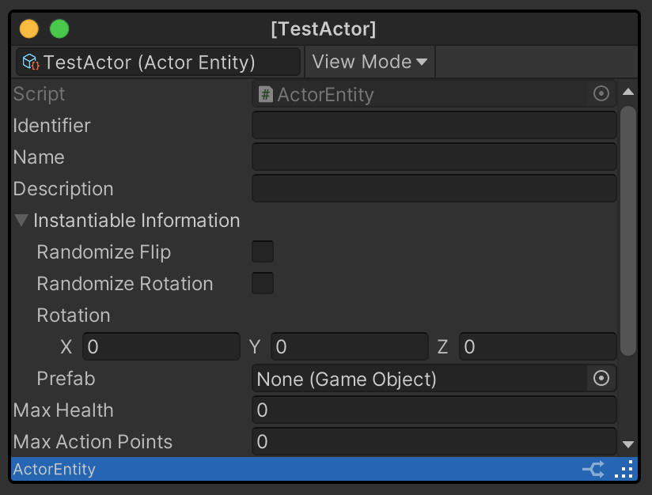 | 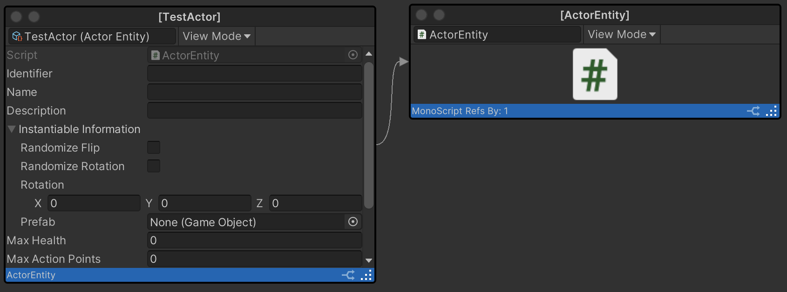 |

* **Show > Prefab References**: This option enables the visualization of all references inside a prefab. This includes references from scripts within the prefab and nested prefabs. Note that all modifications to the nested prefabs are visualized correctly. For example, if a nested prefab reference to a Mesh `A` is modified to be Mesh `B`, Mesh `B` will show up in the graph while Mesh `A` will not.

| Show Prefab References - Disabled                                               | Show Prefab References - Enabled                                              |
| ------------------------------------------------------------------------------- | ----------------------------------------------------------------------------- |
| 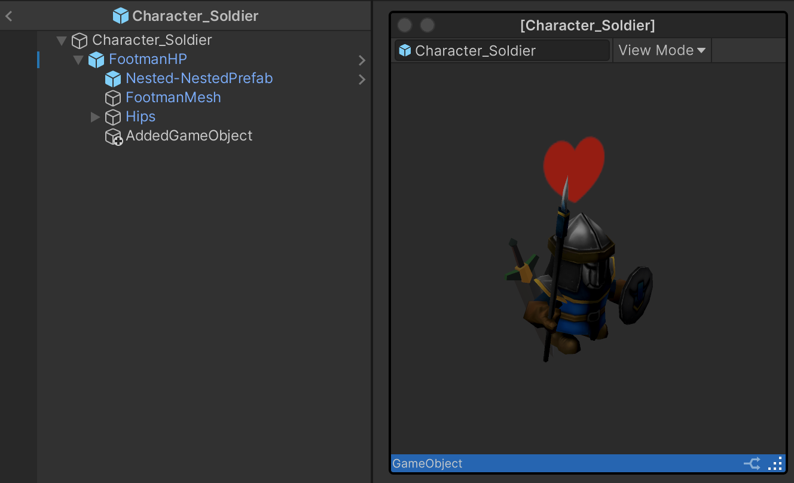 | 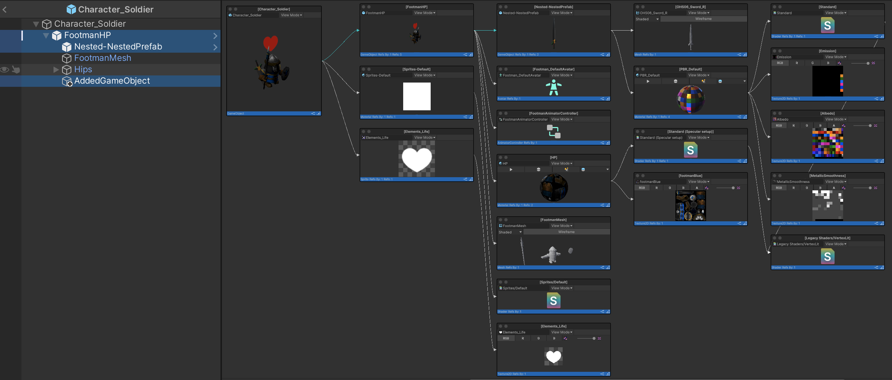 |

#### Reset Button
The reset button allows you to reset all windows the their default state, position and size.

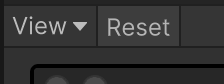

#### Inspected Object Reference
This field is located at the upper right corner and allows you yo assign a reference of an object you want to inspect.

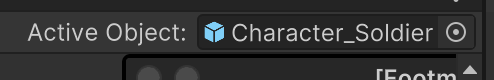

#### Zoom Controls
The Zoom controls are located at the bottom left corner of the main window and give you control of the scale of the visualization. The zoom level is controlled by the slider and the reset button will reset the zoom to 1.
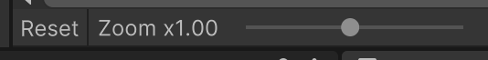

## Inspector Window
The inspector window is a small version of the Unity inspector with extra functionality to better visualize references.

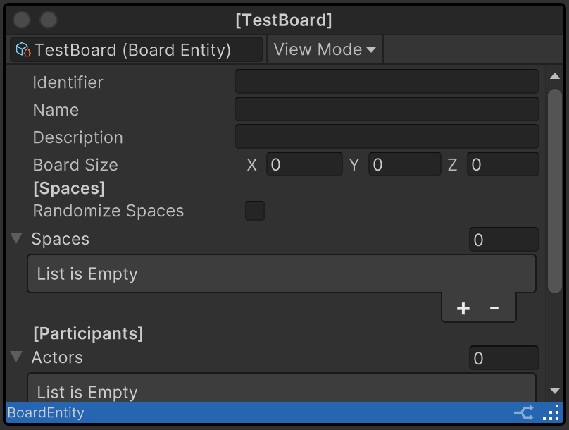

### Controls
The Inspector window gives you extra controls for visualization purposes.

#### Window controls
Currently, the window can be minimized or extended using the buttons at the top left corner.

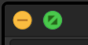

* Minimize: The minimize button (Yellow) will collapse the window leaving only the header and the window controls visible.

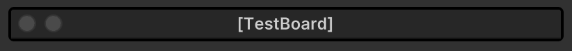

* Extend: The extend button (Green) will eliminate the height restrictions allowing for the entire inspector to be displayed.

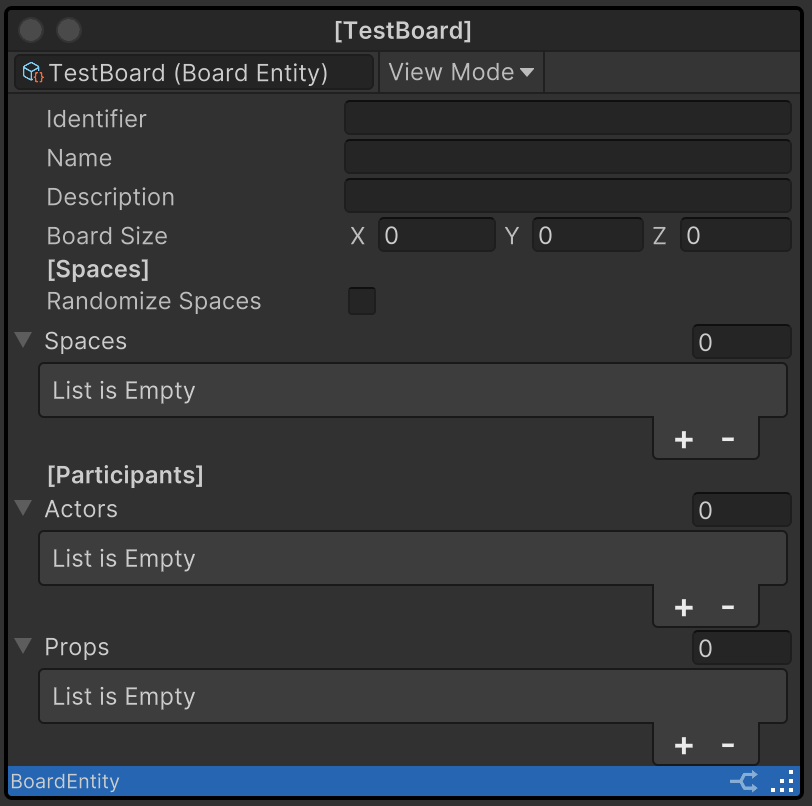

#### Toolbar
The toolbar provides a reference to the object being presented in the window and options to switch the representation of it (See the [Views](#views) section for more information).

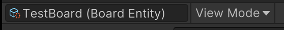

#### Footer
At the bottom of the window you will be able to see more information and controls.

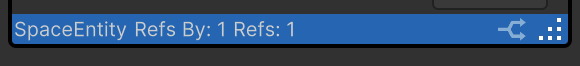

##### Stats
The following information is displayed at the left of the footer:
* Name of the class that is being presented
* Number of references to the object in the graph
* Number of references from the object in the graph

> Note: If there are more than one references from/to a single object to/from the represented in the window, the total number of references will be displayed in brackets (Example: `[Total: 5]`).

##### Controls
At the right of the footer you have the following controls
* Button with a diverging arrow that with lock the highlight of the references to and from the object.
* Resize control that allows you to resize the window by clicking and dragging the dotted corner.

### Views
The window provides different options to visualize the content. Depending on the object compatibility some options will be disabled.

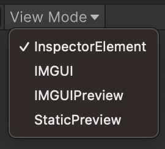

#### Inspector Element
This view mode is available when an object has an inspector that supports [UI Toolkit](https://docs.unity3d.com/Manual/UIElements.html).
> Note: In some occasions UI Toolkit is still supported but it is not displayed correctly.

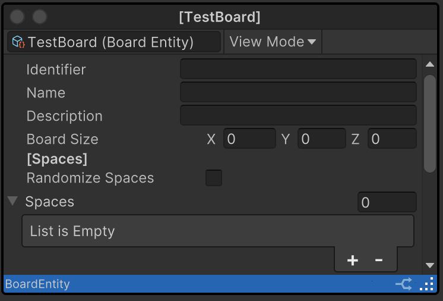

#### IMGUI
This view mode uses the [Immediate Mode GUI](https://docs.unity3d.com/Manual/GUIScriptingGuide.html) inspector to display the content.

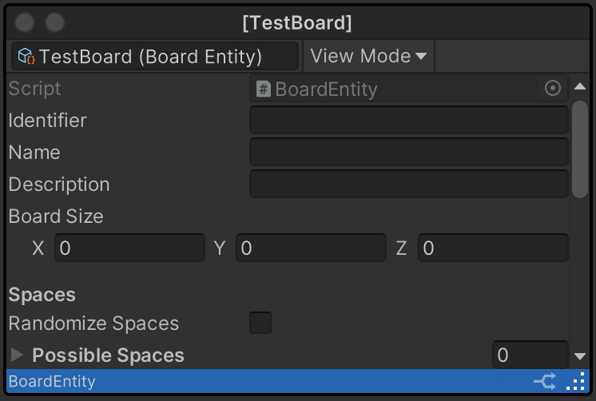

#### Preview
This view mode visualizes a preview of the object (If supported). Very Often, Prefabs with visual elements, 3D Models, Textures and other assets will show this option.

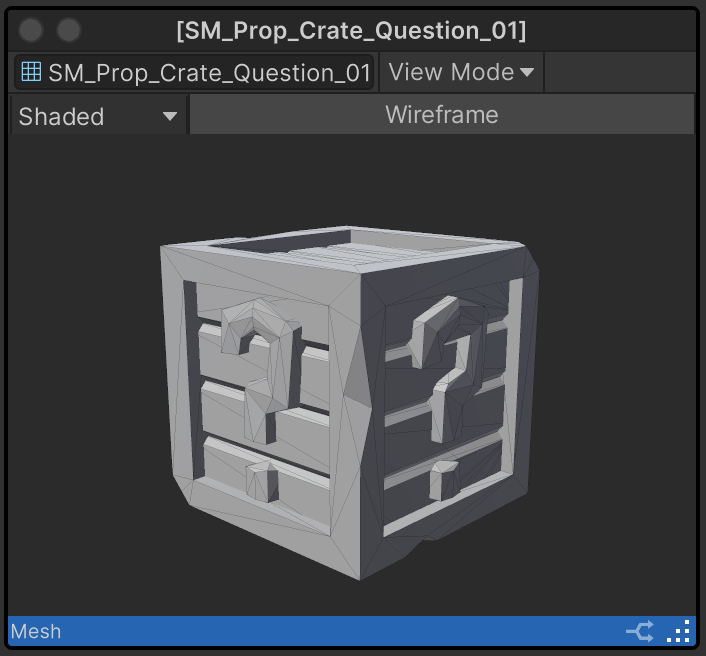

#### Static Preview
The static preview mode shows an image of the object either taken from the Preview or from the default icon based on the type of object.

| Static Preview - Mesh                                                  | Static Preview - Shader                                                    |
| ---------------------------------------------------------------------- | -------------------------------------------------------------------------- |
| 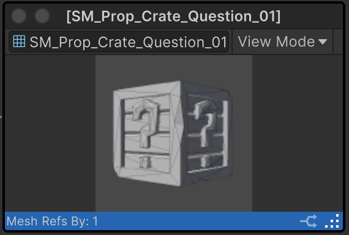 | 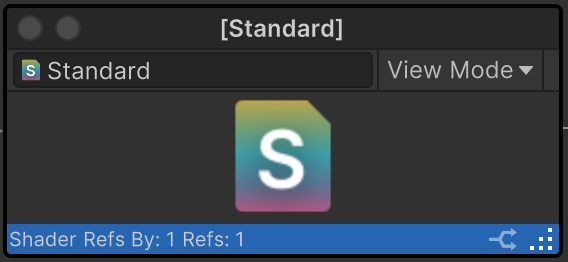 |

### References
References are represented in the graph as curved arrows. The source of the arrow indicate the object that holds the reference and the end of the arrow represents the reference target.

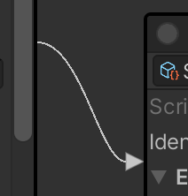

The color of the arrow indicate what type of reference it is:
* White for direct reference on a serialized field
* Cyan for nested prefab references

#### Highlighting
The references to, and from, a specific object will be highlighted by hovering over the header of the inspector window or by activating the highlight lock (See [Footer Controls](#controls-2))

| Reference - Normal                               | Reference - Highlighted                                    |
| ------------------------------------------------ | ---------------------------------------------------------- |
| 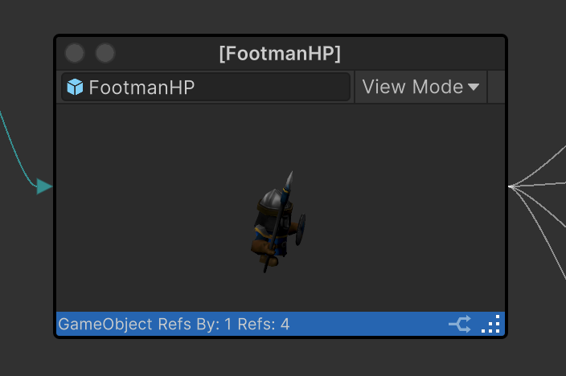 | 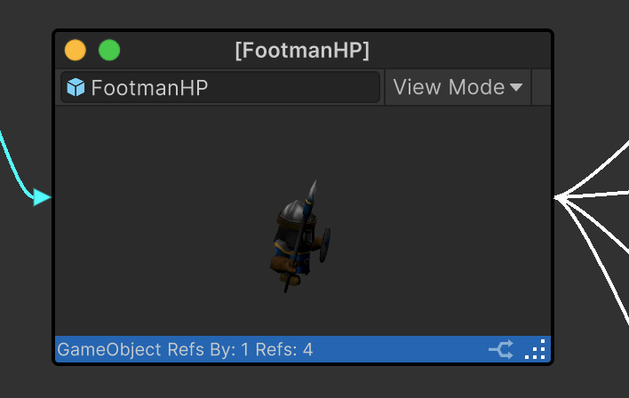 |

